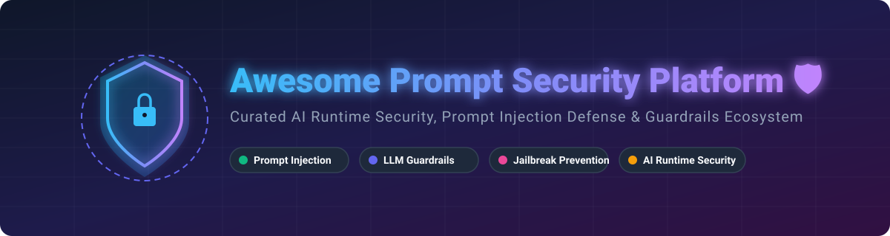

# Awesome Prompt Security Platform 🛡️

  

     

## 🚀 Top Prompt Security & AI Guardrails Platform Ecosystem 🛡️

**Curated List of SaaS Products & Open-Source GitHub Projects**

*Focused on Prompt Injection Defense, Jailbreak Prevention, LLM Guardrails, Input/Output Scanning, AI Red Teaming & AI Runtime Security*

**Last updated: September 2026** 📅

---

### 📌 Overview & Market Insights

This repository tracks notable **SaaS platforms** and **open-source projects** for **Prompt Security** and **Generative AI Defense**. These tools detect and block prompt injection, jailbreaks, data leakage, toxic content, and other risks in LLM inputs and outputs, acting as runtime guardrails or AI firewalls.

> 💡 **Sector Market Size & Dynamics**: The global AI Security & LLM Guardrails market is estimated at **$1.8B – $2.5B in 2026** and growing rapidly at over 35% CAGR as enterprise GenAI adoption explodes. The sector is currently **moderately fragmented**, featuring a mix of enterprise cybersecurity giants acquiring early leaders (e.g. Protect AI acquired by Palo Alto Networks, LayerX acquired by Akamai, Aporia acquired by Coralogix) and specialized high-growth SaaS scale-ups (Lakera, Pangea, Prompt Security).

---

## 📑 Table of Contents
- [SaaS/Hosted Platforms ☁️](#saashosted-platforms-️)
- [Open-Source GitHub Projects 🔓](#open-source-github-projects-)
- [Support & Community 💖](#support--community-)
- [How to Contribute 🤝](#how-to-contribute-)
- [📈 Star History](#-star-history)
- [Disclaimer ⚠️](#disclaimer-️)

---

## SaaS/Hosted Platforms ☁️

Below is the curated comparative matrix of commercial enterprise SaaS solutions, ranked by estimated company scale, valuation, and market footprint (descending).

| Platform | Description | Estimated Scale / Valuation | Starting Tier Price | Free Tier / Trial Limits |
| :--- | :--- | :--- | :--- | :--- |
| **[Protect AI](https://www.protectai.com/)** | Enterprise MLSecOps platform offering model scanning, runtime guardrails, and AI supply-chain security (acquired by Palo Alto Networks). | **~$500M+** (Acquired by Palo Alto Networks / Parent Cap $90B+) | Enterprise Custom Pricing (Sales-gated quote) | Request a Demo (No self-serve free trial) |
| **[LayerX AI Security](https://layerxsecurity.com/)** | Browser and Enterprise AI security solutions protecting LLM interactions (acquired by Akamai). | **~$200M+** (Acquired by Akamai Technologies / Parent Cap $15B+) | Enterprise Custom Pricing (Sales-gated quote) | Request a Demo / Enterprise Pilot (No self-serve free trial) |
| **[Aporia](https://www.aporia.com/)** | ML observability and guardrails platform providing runtime protection for AI applications (acquired by Coralogix). | **~$100M+** (Acquired by Coralogix / $50M+ raised) | Community Tier: $0/month | Free forever up to 1,000,000 predictions/month (up to 3 team members) |
| **[Lakera](https://www.lakera.ai/)** | Leading prompt injection and jailbreak defense platform (Lakera Guard) powered by continuous threat intelligence. | **~$60M – $100M** ($20M+ Series A funding) | Community Tier: $0/month | Free forever up to 10,000 requests/month (8k token limit) |
| **[HiddenLayer](https://hiddenlayer.com/)** | AI security platform focused on model protection, adversarial threat detection, and ML detection/response. | **~$50M – $100M** ($50M+ Series A funding) | Enterprise Custom Pricing (Sales-gated quote) | Request a Demo (No self-serve free trial) |
| **[Pangea](https://pangea.cloud/)** | Comprehensive Security API platform providing modular AI Guardrails, Sanitization, and PII protection. | **~$40M – $80M** ($25M+ Series A funding) | Pay-As-You-Go ($0/month base) | $5 free monthly credit (Developer Free Tier) |
| **[CalypsoAI](https://www.calypsoai.com/)** | Enterprise AI security & governance platform providing guardrails and vulnerability scanning. | **~$40M – $70M** ($23M+ funding) | Enterprise Custom Pricing (Sales-gated quote) | Request a Demo (No self-serve free trial) |
| **[Zenity](https://zenity.io/)** | Security platform focused on low-code/no-code agents and enterprise AI application governance. | **~$30M – $60M** ($16.5M+ Series A funding) | Enterprise Custom Pricing (Sales-gated quote) | Request a Demo / Enterprise POC (No self-serve free trial) |
| **[Prompt Security](https://www.prompt.security/)** | Specialized platform protecting enterprise GenAI applications against prompt injection and data leaks. | **~$25M – $50M** ($18M+ Series A funding) | Enterprise Custom Pricing (Sales-gated quote) | Request a Demo (No self-serve free trial) |
| **[Noma Security](https://www.noma.security/)** | AI Application Security Platform focused on lifecycle security for LLM applications and data. | **~$20M – $40M** ($12M+ Seed funding) | Enterprise Custom Pricing (Sales-gated quote) | Request a Demo (No self-serve free trial) |

---

## Open-Source GitHub Projects 🔓

Open-source LLM security tools offer developer-friendly, programmable guardrails, scanners, and automated red-teaming frameworks. Listed below sorted by **GitHub_Stars (descending)**:

- **[Promptfoo](https://github.com/promptfoo/promptfoo)**   
  🛠️ Popular CLI and library for evaluating LLM outputs, red-teaming prompts, and testing RAG pipelines against prompt injection, jailbreaks, and PII leaks.

- **[Presidio](https://github.com/microsoft/presidio)**   
  🔒 Microsoft's open-source PII detection and anonymization SDK for sanitizing prompt inputs and LLM outputs.

- **[Garak](https://github.com/leondz/garak)**   
  🎯 Generative AI Red-teaming & Vulnerability Scanner for probing LLMs for jailbreaks, prompt injections, and hallucinations.

- **[Guardrails AI](https://github.com/guardrails-ai/guardrails)**   
  🛡️ Python framework for adding structured output validation, guardrails, and automatic corrective retries to LLMs.

- **[NVIDIA NeMo Guardrails](https://github.com/NVIDIA/NeMo-Guardrails)**   
  🌿 NVIDIA's toolkit for adding programmable guardrails (dialog, safety, topical control, and injection prevention) to LLM applications.

- **[PyRIT](https://github.com/Azure/PyRIT)**   
  ⚡ Microsoft's Python Risk Identification Tool for AI, facilitating automated red-teaming and multi-turn attack simulations on GenAI platforms.

- **[LLM Guard](https://github.com/protectai/llm-guard)**   
  ⚙️ Comprehensive security toolkit with lightweight scanners for prompt injection, toxicity, sensitive data, and hallucination detection.

- **[DeepTeam](https://github.com/confident-ai/deepteam)**   
  🧪 Open-source LLM red teaming framework designed for testing RAG systems, agents, and custom guardrails locally.

- **[Rebuff](https://github.com/protectai/rebuff)**   
  🧱 Multi-layered prompt injection detection architecture utilizing heuristics, LLM filtering, and canary tokens.

- **[Vigil](https://github.com/deadbits/vigil-llm)**   
  🔍 Python security scanner for detecting prompt injections, jailbreaks, and toxic content in prompts using vector search and YARA signatures.

---

## 💖 Support & Community

If you find this repository valuable for your AI security research or enterprise deployment, please consider supporting the project:

- ⭐ **Star this repository** to help others discover it!
- 🔀 **Fork & Contribute** your favorite security tools via Pull Requests.
- 📢 **Share with your network** on X/Twitter, LinkedIn, or Reddit.
- ☕ **Buy me a coffee / Sponsor**: Support ongoing maintenance at [GitHub Sponsors](https://github.com/sponsors/ishandutta2007).

Thank you for helping build a safer Generative AI ecosystem! 🙏

---

## 🤝 How to Contribute

1. Fork the repository.
2. Add/edit entries in `README.md` (following the existing table or list format).
3. Ensure tools are relevant to **Prompt Security**, **LLM Guardrails**, or **AI Runtime Protection**.
4. Submit a Pull Request with a descriptive title.

---

## 📈 Star History

---

## ⚠️ Disclaimer

- This is a **community-curated** list — not exhaustive and not an official endorsement.
- Prompt security tools reduce but do not completely eliminate risks from prompt injection, jailbreaks, and data leakage. No guardrail system is 100% foolproof.
- Always apply defense-in-depth principles, robust continuous evaluation, and least-privilege API design.
